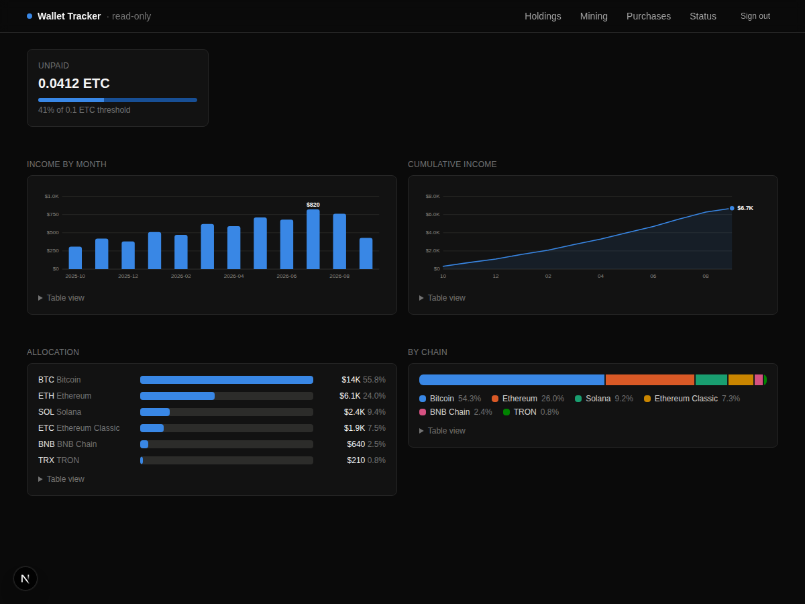
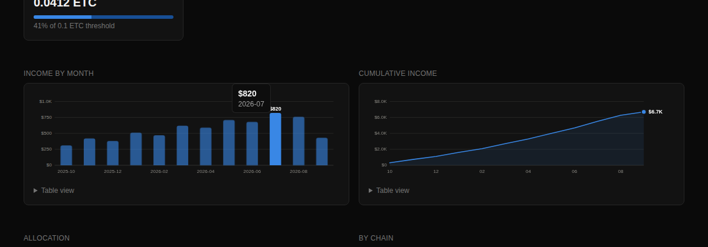

# Wallet Tracker

[](https://github.com/Gpatrickj7/tofte-wallet-tracker-/actions/workflows/ci.yml)
[](LICENSE)
[](package.json)

A read-only dashboard for watching crypto you already own. It shows balances across several chains, logs mining payouts with the USD value at the time they arrived, tracks manual purchases, and exports everything to CSV for tax time.

**It cannot move your money.** There is nowhere to enter a private key or a seed phrase, and no code that signs or sends a transaction. It reads public blockchain data about addresses you give it. That is the entire feature set, and it is deliberate: a tool that only reads is a tool that cannot be tricked into spending.



<p align="center">
  
</p>

Charts are inline SVG with no charting library. Every one has a hover readout, keyboard focus, and a table view. Colors were validated for the dark surface against colour-vision-deficiency and contrast checks, not eyeballed. It works at phone width.

## See it in thirty seconds

No addresses, no database, no signup:

```bash
git clone https://github.com/Gpatrickj7/tofte-wallet-tracker-.git
cd tofte-wallet-tracker-
npm install
DASH_USER=me DASH_PASS=me DEMO_MODE=1 npm run dev
```

Sign in at <http://localhost:3000> with `me` / `me`, then open <http://localhost:3000/demo>. That is the dashboard with sample numbers. When you are ready for your own, follow [Setup](#setup) below.

Prefer containers? `docker compose up` gives you the app and a database together. See [Docker](#docker).

## On your phone or tablet

It installs like an app. Once it is deployed, open it in your phone's browser and:

- **iPhone or iPad:** Share → **Add to Home Screen**.
- **Android:** the browser menu → **Install app** (or **Add to Home screen**).

It then opens full-screen with its own icon, no browser bar. On a phone the navigation moves to a bottom tab bar and tables show their most important columns; everything else is still in the table views under each chart and in the CSV exports. Tablets get the full layout.

This is v1, released as-is under the MIT license.

## Contents

- [What it does](#what-it-does)
- [What it does not do](#what-it-does-not-do)
- [Requirements](#requirements)
- [Setup](#setup)
- [Environment variables](#environment-variables)
- [Deploying](#deploying)
- [Docker](#docker)
- [How it works](#how-it-works)
- [Troubleshooting](#troubleshooting)
- [Security notes](#security-notes)
- [License](#license)

## What it does

| Page | Shows |
|---|---|
| `/` | Holdings across every configured chain, valued in USD, sorted by value |
| `/mining` | Mining payout history with the USD price at the moment each payout landed |
| `/purchases` | A manual log of what you bought, when, and for how much |
| `/status` | Diagnostics: which chains responded, which failed, and why |

Supported chains: **Ethereum, BNB Chain, Ethereum Classic, Solana, Bitcoin, TRON, Linea, Monad.**

It also discovers ERC-20, SPL and TRC-20 tokens held by your addresses and prices them by contract, and it flags two things worth flagging: tokens impersonating a native coin, and airdropped tokens with no real price. Those are the two most common ways a wallet display gets manipulated into showing a number that is not real.

Mining payouts are read from **2miners**. It is the only pool supported in v1.

CSV export is available for both payouts and purchases, at `/api/export/payouts` and `/api/export/purchases`.

## What it does not do

- It does not trade, swap, send, or sign anything.
- It does not accept a private key or seed phrase. There is no field for one.
- It does not talk to an exchange or hold an exchange API key.
- It does not give tax or financial advice. It produces a CSV; what you do with it is between you and your accountant.

## Requirements

- **Node.js 22** or newer
- A **public wallet address** for each chain you want to watch. Receiving addresses only.
- Optional: a **MongoDB** connection string, if you want the purchase log and stored payout history to persist. The free Atlas tier is enough. Holdings work without any database.

## Setup

Run these four commands:

```bash
git clone https://github.com/Gpatrickj7/tofte-wallet-tracker-.git
cd tofte-wallet-tracker-
npm install
cp .env.example .env.local
```

Then open `.env.local` and set at minimum:

```
DASH_USER=pick-a-username
DASH_PASS=pick-a-long-password
ETH_ADDRESS=0xYourPublicAddressHere
```

Start it:

```bash
npm run dev
```

Open <http://localhost:3000>. You will get a login page. Use the username and password you just set.

That is the whole setup. Every wallet variable is optional and independent, so you can start with one chain and add more later. A blank address means that chain is skipped entirely, not broken.

## Environment variables

Every variable is read from the environment. None are hardcoded, and nothing has a secret default.

### Required

| Variable | What it is |
|---|---|
| `DASH_USER` | Username for the login page. |
| `DASH_PASS` | Password for the login page. Use a long random one. |

If either is unset the app refuses every request. That is intentional and there is no override. An unconfigured deployment is a locked deployment, not an open one.

### Wallet addresses, all optional

| Variable | Chain |
|---|---|
| `ETH_ADDRESS` | Ethereum, and Linea |
| `BSC_ADDRESS` | BNB Chain |
| `ETC_ADDRESS` | Ethereum Classic |
| `SOL_ADDRESS` | Solana |
| `BTC_ADDRESS` | Bitcoin |
| `TRX_ADDRESS` | TRON |
| `BSC_TOKENS` | Extra BEP-20 contract addresses, comma-separated, for tokens not found automatically |

Linea has no variable of its own; it reads `ETH_ADDRESS`, because it is the same address format and usually the same wallet.

### Mining, optional

| Variable | What it is |
|---|---|
| `POOL` | Pool name. Only `2miners` works in v1. |
| `POOL_ADDRESS` | The payout address you registered with the pool. Leave blank to hide the mining page. |

### Storage, optional

| Variable | What it is |
|---|---|
| `MONGODB_URI` | MongoDB connection string. Needed for purchases, stored payout history, and the portfolio-value-over-time chart. |
| `MONGODB_DB` | Database name. Defaults to `wallet_tracker`. |

Without `MONGODB_URI` the holdings pages work normally and the pages that need storage will tell you they are unconfigured rather than crashing. With it, the app records one portfolio-value snapshot per day, and the value-over-time line appears once there are two.

### Demo, optional

| Variable | What it is |
|---|---|
| `DEMO_MODE` | Set to `1` to enable `/demo`, a dashboard of sample numbers. Leave unset in production. |

## Deploying

It is a standard Next.js app and deploys anywhere Next.js runs.

**On Vercel, one click:**

[](https://vercel.com/new/clone?repository-url=https%3A%2F%2Fgithub.com%2FGpatrickj7%2Ftofte-wallet-tracker-&env=DASH_USER,DASH_PASS&envDescription=Login%20for%20your%20dashboard.%20Add%20wallet%20addresses%20afterwards%20under%20Settings%20%E2%86%92%20Environment%20Variables.&project-name=wallet-tracker&repository-name=wallet-tracker)

It asks for `DASH_USER` and `DASH_PASS` up front, since the app refuses every request without them. Add wallet addresses afterwards under **Settings → Environment Variables** and redeploy.

**On Vercel, by hand:**

1. Push your fork to GitHub.
2. Import the repository in Vercel. It detects Next.js automatically; accept the defaults.
3. Add your environment variables under **Settings → Environment Variables**, scoped to **Production**.
4. Deploy.

Set the variables *before* the first deploy, or the build will succeed and every request will be refused for lack of `DASH_USER` and `DASH_PASS`. That is the app working correctly, not an error.

**Anywhere else:** `npm run build` then `npm start`. It needs Node 22.

## Docker

The app and a MongoDB together, in one command:

```bash
cp .env.example .env.local   # put your addresses in here
docker compose up
```

Open <http://localhost:3000>. The default login is `admin` / `change-me-before-exposing-this`; override it by setting `DASH_USER` and `DASH_PASS` in your shell or in `.env.local`. The bundled database persists in a named volume, so your purchase log survives restarts.

To use Atlas instead of the bundled database, set `MONGODB_URI` in `.env.local` and the compose file will pick it up over the default.

The image runs as an unprivileged user and contains only production dependencies.

## How it works

**Balances come from public RPC endpoints and block explorers.** Every chain has more than one provider configured, and a failure falls through to the next one rather than taking the page down. `/status` shows you which provider answered and which did not.

**Balances are cached for 60 seconds.** Refreshing the page repeatedly will not hammer the providers or get you rate limited. There is a Refresh link when you want current numbers.

**Prices come from a price API, with a DEX fallback** for tokens the main source does not list.

**Mining payouts record the USD value at the moment they arrived, once.** That number is never recalculated afterwards. This matters more than it sounds: mining income is income when you receive it, valued at that time. Recomputing it later at today's price does not update your books, it destroys them.

**Wrapped and bridged tokens are kept on their own line** and never added into the native coin's total. They track the price of the real thing without being the real thing, and summing them produces a tidy number that quietly misrepresents what you are actually holding.

## Troubleshooting

**Every page redirects to login, and the right password does not work.**
Check that `DASH_USER` and `DASH_PASS` are both set in the environment the app is actually running in. On Vercel, confirm they are scoped to the environment you are visiting, and redeploy after adding them. Environment variables are read at runtime, but a fresh deploy is the reliable way to be sure.

**A chain shows nothing.**
Check `/status`. It lists each chain and whether its provider responded. An address left blank is skipped silently by design, so the first thing to confirm is that the variable is actually set.

**Balances look stale.**
They are cached for 60 seconds. Use the Refresh link.

**The purchases or mining page says it is unconfigured.**
That means `MONGODB_URI` is not set. Those two pages need storage; holdings do not.

**A token shows up that I do not recognise, or one is flagged.**
Airdropped tokens arrive in wallets unsolicited all the time, and some are built to impersonate a real coin. The app flags the ones it can detect. Treat anything flagged as untrustworthy, and never visit a website named inside a token you did not buy.

## Security notes

**This app never asks for a private key or a seed phrase.** If any version of it ever does, it is not this software. Nothing legitimate here needs one, because reading public balances does not require the ability to spend.

**Your addresses are public data, but publishing them is still a choice.** Anyone who knows an address can see its full balance and transaction history forever. Putting your addresses in a deployed app is fine; putting them in a public git repository ties them to your name permanently. Keep them in `.env.local` and in your host's environment variables, never in a commit. The `.gitignore` here is set up to prevent that, but it cannot stop a deliberate `git add -f`.

**The login is a single shared username and password.** It is meant to keep a personal dashboard private, not to serve multiple users. Use a long random password and do not reuse one from anywhere else.

**Set your environment variables before your first deploy.** An app deployed without them refuses all requests, which is the safe failure, but it is better not to have a window where a half-configured deployment is public at all.

## License

MIT. Use it, fork it, sell it, whatever you want. No warranty: check the numbers it gives you before making a decision based on them.
